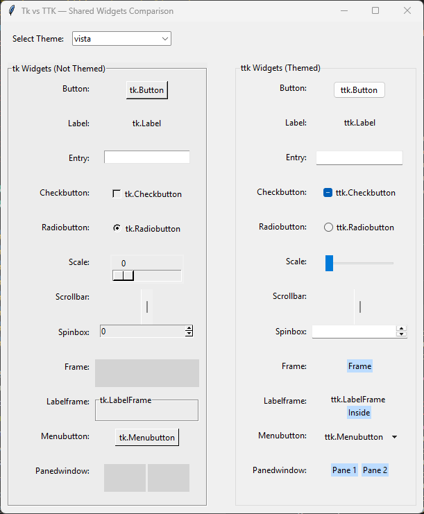
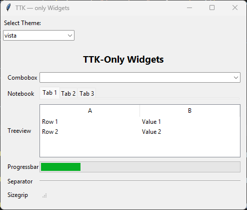

====================================================
Importing tkinter themed widgets
====================================================

| In **Tkinter**, themed widgets play a crucial role in determining the "look and feel" of all the widgets.
| See: Tkinter ttk Themed Widgets - Python Tutorial. `<https://www.pythontutorial.net/tkinter/tkinter-ttk/>`_.
| See: TkDocs Tutorial - Styles and Themes. `<https://tkdocs.com/tutorial/styles.html>`_.
| See: Tkinter Themes - python tutorials. `<https://python-tutorials.in/tkinter-themes/>`_.
| See: How to Change Tkinter Theme from One to Another - Python Tutorial. `<https://www.pythontutorial.net/tkinter/tkinter-theme/>`_.

----

**Classic Tk Widgets**:
----------------------------

   - These widgets were introduced in 1991 and are part of the original Tkinter library.
   - They have a consistent appearance across platforms but lack the native look and feel.

----

**Themed Tk Widgets (ttk)**:
-----------------------------------

   - Added in 2007 with Tk 8.5, these widgets are an improved version of the classic ones.
   - They aim to separate widget behavior from appearance through a styling system.
   - Themed widgets adapt to the native look and feel of the platform where the program runs.
   - They are imported from the `tkinter.ttk` module.

----

**Advantages of Using Themed Widgets**:
-------------------------------------------------

   - **Behavior-Appearance Separation**: Themed widgets separate code that implements behavior from appearance.
   - **Native Look & Feel**: They provide a native look on different platforms.
   - **Simplified State-Specific Behavior**: ttk widgets simplify state-specific widget behavior.

----

**Themed Widgets**:
----------------------------------

- **Button:** Themed push button (`ttk.Button`)
- **Checkbutton:** Themed checkbox (`ttk.Checkbutton`)
- **Radiobutton:** Themed radio button (`ttk.Radiobutton`)
- **Label:** Text or image display (`ttk.Label`)
- **Entry:** Single-line text input (`ttk.Entry`)
- **Frame:** Container widget (`ttk.Frame`)
- **Labelframe:** Frame with a label border (`ttk.Labelframe`)
- **Menubutton:** Button that shows a menu (`ttk.Menubutton`)
- **Panedwindow:** Resizable panes/sash container (`ttk.Panedwindow`)
- **Scale:** Slider control (`ttk.Scale`)
- **Scrollbar:** Scrollbar for list, text, canvas, etc. (`ttk.Scrollbar`)
- **Spinbox:** Numeric/text spinner control (`ttk.Spinbox`)

- **Combobox:** Drop-down selection + optional text entry (`ttk.Combobox`)
- **Notebook:** Tabbed interface (`ttk.Notebook`)
- **Progressbar:** Progress indicator (`ttk.Progressbar`)
- **Separator:** Visual separator line (`ttk.Separator`)
- **Sizegrip:** Resize handle, usually in a window corner (`ttk.Sizegrip`)
- **Treeview:** Hierarchical and tabular data display (`ttk.Treeview`)

----

Comparison of Classic Tk Widgets and Themed Tk Widgets
------------------------------------------------------------

----

New Themed Tk Widgets
------------------------------------------------------------

