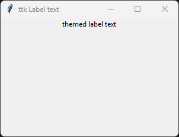
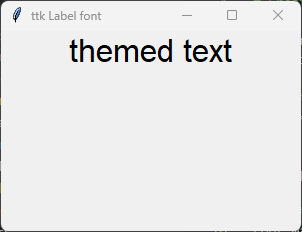
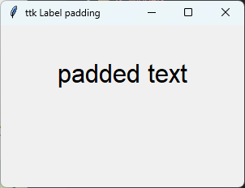
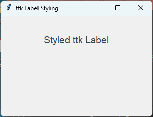
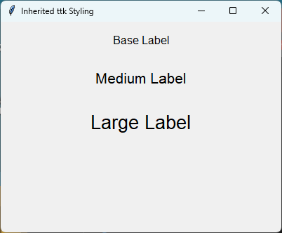

====================================================
ttk Label
====================================================

| See: `<https://docs.python.org/3/library/tkinter.ttk.html#label>`_

----

Usage
---------------

| The `tkinter.ttk.Label` widget provides a themed text label.
| The themed ``ttk`` widgets offer a more modern appearance across different operating systems compared to classic ``tk`` widgets.
| To create a themed label widget the general syntax is
| (assuming import via "from tkinter import ttk"):

.. py:function:: label_widget  = ttk.Label(parent, option=value)

    | `parent` is the window or frame object.
    | Options can be passed as parameters separated by commas.

----

Text
--------------

.. py:function:: label_widget  = ttk.Label(parent, text=text_string)

    | `text_string` is text to display in the label widget.
    | e.g. label = ttk.Label(root, text="themed label text")

Text example
~~~~~~~~~~~~~~~~~~

.. code-block:: python

    import tkinter as tk
    from tkinter import ttk

    # Create the main window
    root = tk.Tk()
    root.geometry("300x200")  # Set window size
    root.title("ttk Label text")  # Set window title

    # Create the themed label widget
    label = ttk.Label(root, text="themed label text")

    # Pack the label into the window
    label.pack()

    # Run the main event loop
    root.mainloop()

----

Font
----------

.. py:function:: label_widget  = ttk.Label(parent, font=(font_type, font_size, font_style))

   - font_type is a font name. e.g "Arial"
   - font_size is the size of the font.  eg. 12
   - font_style can be bold, italic, underline or a space separated combination
   - Default Value: System-dependent themed default font
   - Description: Specifies the font family, size, and style for the themed label text.

font example
~~~~~~~~~~~~~~~~~~

.. code-block:: python

    import tkinter as tk
    from tkinter import ttk

    # Create the main window
    root = tk.Tk()
    root.geometry("300x200")  # Set window size
    root.title("ttk Label font")  # Set window title

    # Create the label widget with options
    label = ttk.Label(root, text="themed text", font=("Arial", 24))

    # Pack the label into the window
    label.pack()

    # Run the main event loop
    root.mainloop()

----

Padding
-------------------

.. py:function:: label_widget  = ttk.Label(parent, padding=padding_value)

   - padding_value can be a single integer, a tuple of two integers ``(x, y)``, or a tuple of four integers ``(left, top, right, bottom)``.
   - Default Value: 0
   - Description: Adds extra space (in pixels) inside the widget border surrounding the text.
   - Note: Unlike classic ``tk.Label`` which uses ``padx`` and ``pady``, ``ttk.Label`` uses a single ``padding`` parameter.

padding example
~~~~~~~~~~~~~~~~~~

.. code-block:: python

    import tkinter as tk
    from tkinter import ttk

    # Create the main window
    root = tk.Tk()
    root.geometry("300x200")  # Set window size
    root.title("ttk Label padding")  # Set window title

    # Create the label widget with 40 pixels left/right and 20 pixels top/bottom padding
    label = ttk.Label(root, text="padded text", font=("Arial", 24), padding=(40, 20))

    # Pack the label into the window
    label.pack(pady=20)

    # Run the main event loop
    root.mainloop()

----

Styling
----------------------------

| Configurations involving background, foreground, and border configurations are often managed via a ``ttk.Style`` object.

.. py:function:: style.configure("Name.TWidget", option=value)

    * **Name.TWidget**: A string combining your custom name and the target widget class (e.g., `"Highlight.TButton"`).
    * **option**: A keyword argument specifying the attribute to change (e.g., `background`, `foreground`, `font`).
    * **Description**: Defines the visual properties for a specific widget class. The configuration applies to all widgets assigned to this style name. The style name can be used to apply the configuration to multiple widgets.

.. code-block:: python

    import tkinter as tk
    from tkinter import ttk

    root = tk.Tk()
    root.geometry("300x200")
    root.title("ttk Label Styling")
    root.configure(bg='#f0f0f0')  #default

    style = ttk.Style()

    # Define the font within the style configuration
    style.configure(
        "Custom.TLabel",
        foreground="#36454F",
        background="#f0f0f0",
        font=("Arial", 14),  # Font included here
        padding=(10, 10),
    )

    # Style applied here; no need to pass font= parameter
    label = ttk.Label(root, text="Styled ttk Label", style="Custom.TLabel")
    label.pack(pady=25)

    root.mainloop()

| In the code below, the `Base.TLabel` style is inherited by `Medium.Base.TLabel` and `Large.Base.TLabel`.
| This means that the `font` property of `Medium.Base.TLabel` and `Large.Base.TLabel` will override the `font` property of `Base.TLabel`.

.. code-block:: python

    import tkinter as tk
    from tkinter import ttk

    root = tk.Tk()
    root.geometry("400x300")
    root.title("Inherited ttk Styling")

    style = ttk.Style()

    # 1. Base style: Defines shared properties (colors, relief, etc.)
    style.configure("Base.TLabel",
        foreground="#000000",
        background="#E4E4E4",
        font=("Arial", 12),
        padding=(10, 5),
    )

    # 2. Inherit and override: Each child overrides font AND the background color

    style.configure("Medium.Base.TLabel", font=("Arial", 16))

    style.configure("Large.Base.TLabel", font=("Arial", 20))

    # 3. Apply the specific styles
    label1 = ttk.Label(root, text="Base Label", style="Base.TLabel")
    label1.pack(pady=10)

    label2 = ttk.Label(root, text="Medium Label", style="Medium.Base.TLabel")
    label2.pack(pady=10)

    label3 = ttk.Label(root, text="Large Label", style="Large.Base.TLabel")
    label3.pack(pady=10)

    root.mainloop()

----

Options
--------------

.. py:function:: label_widget = ttk.Label(parent, option=value)

    | parent is the window or frame object.
    | Options can be passed as parameters separated by commas.

    **Parameters:**

    .. py:attribute:: anchor

        | Syntax: ``label_widget = ttk.Label(parent, anchor="position")``
        | Description: Specifies how the information is positioned within the widget if there is extra space. Options are "nw", "n", "ne", "w", "center", "e", "sw", "s", "se".
        | Default: center

    .. py:attribute:: compound

        | Syntax: ``label_widget = ttk.Label(parent, compound="position")``
        | Description: Specifies the relative position of the image relative to the text. Options include "none", "center", "top", "bottom", "left", "right".
        | Default: none

    .. py:attribute:: cursor

        | Syntax: ``label_widget = ttk.Label(parent, cursor="cursor_type")``
        | Description: Sets the mouse cursor appearance when hovering over the label.
        | Default: None

    .. py:attribute:: font

        | Syntax: ``label_widget = ttk.Label(parent, font="font")``
        | Description: Sets the font of the label text.
        | Default: TkDefaultFont

    .. py:attribute:: image

        | Syntax: ``label_widget = ttk.Label(parent, image="image")``
        | Description: Sets an image to be displayed in the label. If specified, it can be combined with text using the ``compound`` option.
        | Default: None

    .. py:attribute:: justify

        | Syntax: ``label_widget = ttk.Label(parent, justify="alignment")``
        | Description: Sets the justification of multi-line text within the widget layout bounds. Use "left", "right", or "center".
        | Default: left

    .. py:attribute:: padding

        | Syntax: ``label_widget = ttk.Label(parent, padding=value)``
        | Description: Sets internal padding inside the widget border. Can accept a single value or multi-integer element collections (e.g., ``(x, y)``).
        | Default: 0

    .. py:attribute:: style

        | Syntax: ``label_widget = ttk.Label(parent, style="StyleName.TLabel")``
        | Description: Specifies the custom themed layout configuration to apply to this widget instance.
        | Default: TLabel

    .. py:attribute:: text

        | Syntax: ``label_widget = ttk.Label(parent, text="text")``
        | Description: Sets the literal string contents displayed by the widget.
        | Default: None

    .. py:attribute:: textvariable

        | Syntax: ``label_widget = ttk.Label(parent, textvariable=variable)``
        | Description: Binds a Tkinter StringVar tracker variable to dynamically alter text synchronization.
        | Default: None

    .. py:attribute:: underline

        | Syntax: ``label_widget = ttk.Label(parent, underline=index)``
        | Description: Marks an integer character placement string value index to highlight for hotkey reference.
        | Default: -1

    .. py:attribute:: width

        | Syntax: ``label_widget = ttk.Label(parent, width=value)``
        | Description: If greater than zero, specifies how many characters wide the label layout box boundary constraint should enforce.
        | Default: 0

    .. py:attribute:: wraplength

        | Syntax: ``label_widget = ttk.Label(parent, wraplength=value)``
        | Description: Maximum structural layout pixel size target limits before automatic multi-line newline wrap parsing breaks take effect.
        | Default: 0